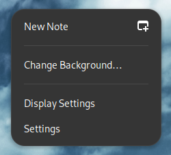
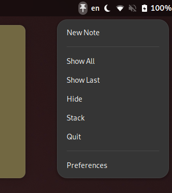

# Sticky Notes Integration

Gnome Shell extension providing minimal integration for [Sticky Notes](https://flathub.org/apps/com.vixalien.sticky), including a panel indicator and additional entries in Gnome's background menu.
Useful to manage notes in busy desktops (high number of windows/notes, multiple monitors).

### Features

- **Background Menu Override**: adds a *New Note* entry to Gnome's default background menu, creating new notes at custom positions in your workspace;
- **Panel Indicator**: panel indicator with options to create, show/hide and cycle notes, among others;
- **Quick Actions**: allows binding mouse triggers (button presses,scroll) to different quick actions e.g. show or hide notes;
- **Versatile and Dynamic Behavior**: visiblity of background menu and indicator position can be automated to follow Sticky Notes open/closed status;
- **General Purpose Tools**: convenience toggles to auto-start Sticky Notes or keeping it running in the background.

### Disclaimer

I am in no way associated with the [Sticky Notes](https://flathub.org/apps/com.vixalien.sticky) project.
For inquiries and bug reporting regarding the Sticky Notes app refer to the [project page](https://github.com/vixalien/sticky).
And if you like the software, please [support](https://buymeacoffee.com/vixalien) them!

This extension was developed and tested in Gnome 46 and is provided free of charge and with no warranty under the [GPL v2](LICENSE) license.
Parts of its code base were inspired and/or borrowed by the following extensions:

- [Activate Window by Title](https://extensions.gnome.org/extension/5021/activate-window-by-title/) (*GPL v2*)
- [Transmission Daemon Indicator NG](https://extensions.gnome.org/extension/6204/transmission-daemon-indicator-ng/) (*MIT*)
- [Arch Linux Updates indicator](https://extensions.gnome.org/extension/1010/archlinux-updates-indicator/) (*GPL v3*)
- [LogoMenu](https://extensions.gnome.org/extension/4451/logo-menu/) (*GPL v2*)

### Known Bugs & Issues

These limitations are known and will likely be fixed on upcoming releases:

- 'New Note' clears note open/close status (should be fixed on , see [#126](https://github.com/vixalien/sticky/issues/126#issuecomment-2147143184));
- Excessive spacing between indicator and note count (when enabled).

